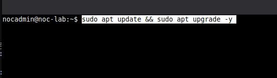
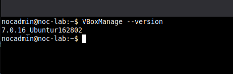
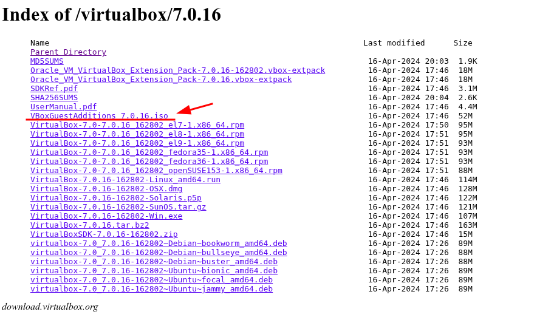
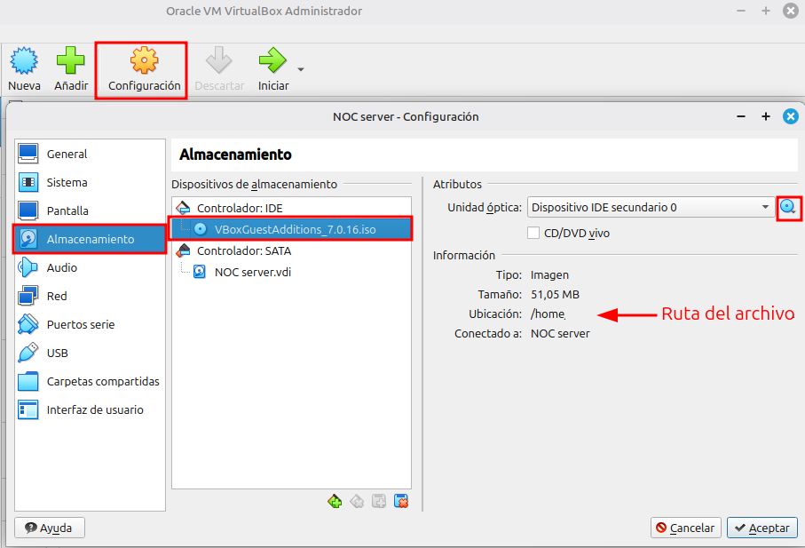
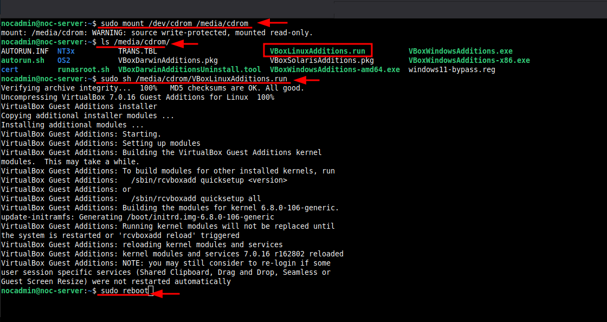
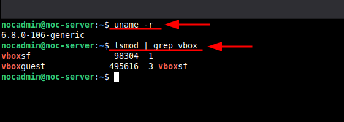

# Instalación de VirtualBox en Linux Mint

---

## Descripción

Este documento describe el proceso de instalación de VirtualBox en un entorno Linux Mint basado en Ubuntu, utilizado como base para la creación de un laboratorio NOC.

---

## Objetivo

- Instalar VirtualBox versión **7.0.16**
- Preparar el entorno para la creación de máquinas virtuales
- Evitar errores comunes (kernel panic, dependencias)

---

## Requisitos

- **Sistema Operativo Host:** Linux Mint 22.2 Cinnamon.
- **Kernel Estable:** 6.8.0-106-generic (LTS).
- **Software:** Oracle VM VirtualBox 7.0.16

---

## Descarga del paquete

Seleccionar la versión compatible con Ubuntu 22.04 (Jammy):

virtualbox-7.0_7.0.16-162802~Ubuntu~jammy_amd64.deb

---

## Instalación

### 1. Actualizar el sistema

```bash
sudo apt update && sudo apt upgrade -y
```



---

### 2. Instalar dependencias necesarias

```bash
sudo apt install -y dkms build-essential linux-headers-$(uname -r)
```

---

### 3. Instalar VirtualBox

Ubicarse en la carpeta donde se descargó el paquete:

``` bash
cd ~/Descargas
```

Instalar:

```bash
sudo dpkg -i virtualbox-7.0_7.0.16-162802~Ubuntu~jammy_amd64.deb
```

---

### 4. Resolver dependencias (si aplica)

```bash
sudo apt -f install -y
```

---

### 5. Verificar instalación

```bash
VBoxManage --version
```

Resultado esperado:

> 7.0.16r162802 // 7.0.16_Ubuntur162802



---

## 6. Instalación de Guest Additions dentro de la VM (Método Manual)

⚠️ El Problema: Error de Descarga de Certificado

Al intentar instalar las Guest Additions mediante el menú de VirtualBox (`Dispositivos > Insertar imagen de CD`), el sistema presenta el error: **"Durante descarga de certificado: Razón desconocida"**. Esto impide que el hipervisor descargue el archivo ISO automáticamente por comandos o GUI.

`Análisis`

Este fallo ocurre usualmente por problemas de red en el host, desactualización de certificados SSL o bloqueos del servidor de Oracle, dejando el sistema sin controladores para la integración fluida de mouse y video.

**Solución Paso a Paso

🔹 **Paso 1:** Descarga Manual desde el Host

Dado que el comando interno falla, se debe descargar el archivo ISO directamente desde el repositorio oficial de Oracle:

- **Link:** [https://download.virtualbox.org/virtualbox/7.0.16/](https://www.google.com/url?sa=E&q=https%3A%2F%2Fdownload.virtualbox.org%2Fvirtualbox%2F7.0.16%2F)
- **Archivo:** `VBoxGuestAdditions_7.0.16.iso`



🔹 **Paso 2:** Carga en el Controlador IDE

   1. Apaga la Máquina Virtual
   2. Ve a **Configuración > Almacenamiento.**
   3. Selecciona el **Controlador IDE (Unidad de CD).**
   4. En el icono del disco azul, selecciona **Elegir un archivo de disco...** y busca el ISO descargado.



🔹 **Paso 3:** Instalación dentro de la VM (Ubuntu Server)

Una vez iniciada la VM, el ISO no se monta automáticamente en versiones Server, por lo que debe hacerse manualmente.

### 1. Crear punto de montaje si no existe

```bash
sudo mkdir -p /media/cdrom
```

### 2. Montar la unidad de CD

```bash
sudo mount /dev/sr0 /media/cdrom
```

### 3. Visualizar los archivos instaladores

```bash
ls /media/cdrom
```

### 4. Ejecutar el instalador de Linux (Script .run)

```bash
sudo sh /media/cdrom/VBoxLinuxAdditions.run
```

### 5. Reiniciar el sistema para aplicar cambios

```bash
sudo reboot
```



---

## 7. Utilidad de las Guest Additions

Estos controladores son fundamentales para que el laboratorio se sienta profesional y eficiente, ya que habilitan:

- **Fluidez del mouse:** Elimina el lag o retraso al mover el cursor.
- **Scroll fluido:** Permite navegar por terminales largas sin interrupciones.
- **Portapapeles compartido:** Permite copiar comandos desde el chat o navegador del host y pegarlos en la VM.
- **Resolución dinámica:** La pantalla se ajusta automáticamente al tamaño de la ventana de VirtualBox.
- **Carpetas compartidas:** Permite mover archivos entre Linux Mint y la VM de forma directa.

---

## 8. Validación de Funcionamiento

Para confirmar que todo está operando correctamente bajo el kernel estable y con los módulos cargados:

Validar versión de kernel activa (Debe ser 6.8.0-106)

```bash
uname -r 
```

Validar módulos de VirtualBox y Guest Additions cargados

```bash
lsmod | grep vbox 
```

Si la salida muestra **vboxguest**, **vboxdrv** y **vboxvideo**, la integración ha sido exitosa



---

## ⚠️ Importante

- La versión del Extension Pack debe coincidir con VirtualBox
- No mezclar versiones diferentes
- Evitar paquetes de otras distribuciones (Debian, versiones antiguas)

---

## Validación

- VirtualBox abre correctamente
- Se puede crear una VM
- No hay errores de kernel

---

## 🚨 Problemas conocidos

|Problema|Solución|
|---|---|
|Kernel panic|Ver [Kernel Panic + VirtualBox](/05-Incidentes/virtualbox-kernel-panic.md)|
|USB no funciona|Verificar Extension Pack|
|Error de módulos|Reinstalar headers|
