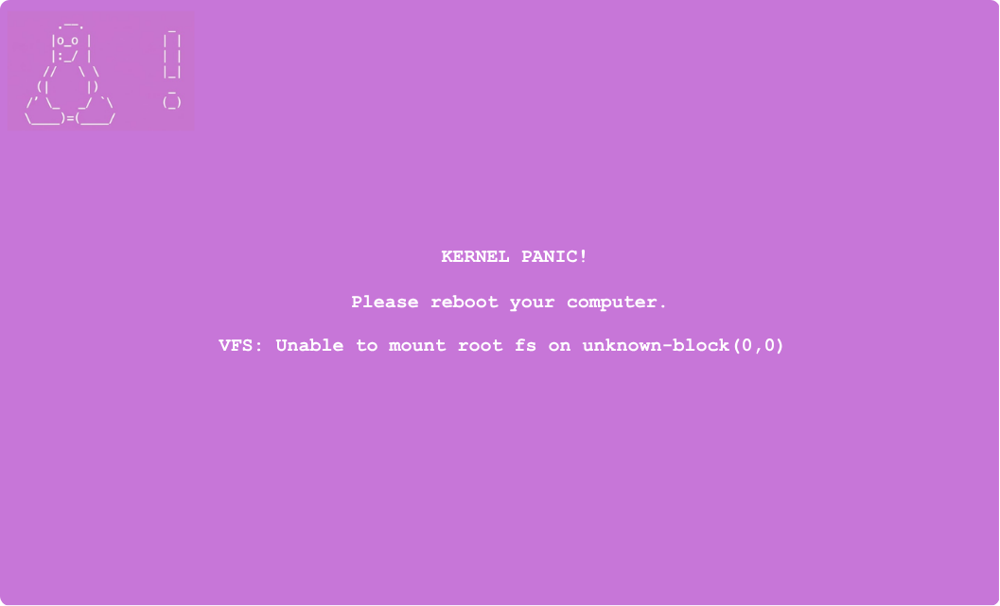
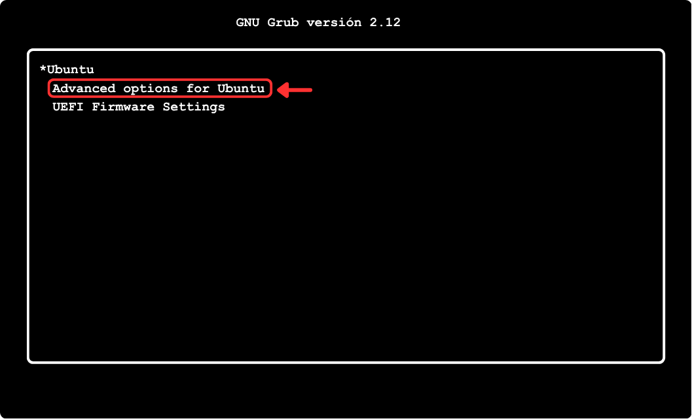
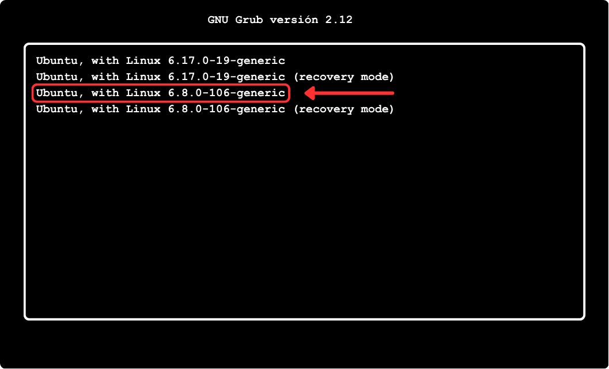
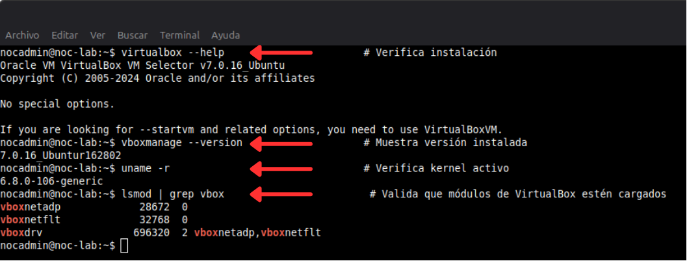
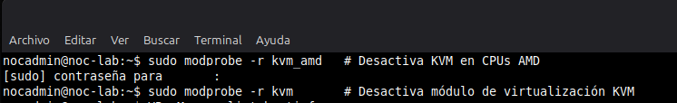

# 🖥️ Instalación de VirtualBox y resolución Kernel Panic

## 1 Introducción

Este documento describe cómo instalar **VirtualBox 7.0.16** en Linux Mint 22.2 y cómo resolver un error crítico de **kernel panic** causado por incompatibilidades con ciertos kernels (6.14 y 6.17).  

El objetivo es documentar paso a paso la solución y dejar evidencia para laboratorio NOC.

## 2 Entorno de trabajo

- Sistema operativo: Linux Mint 22.2  
- Kernel problemático: 6.14 / 6.17  
- Kernel estable: 6.8.0-106-generic (LTS)  
- VirtualBox: 7.0.16  

## 3 Problema presentado

Al reiniciar el sistema con kernels incompatibles se presentaba:

Kernel panic!
VFS: unable to mount root fs on unknown-block(0,0)

   

**Nota_azul:** Imagen recreada con fines educativos basada en entorno real de laboratorio.

> Nota_gris: Imagen recreada con fines educativos basada en entorno real de laboratorio.

Nota_gris: Imagen recreada con fines educativos basada en entorno real de laboratorio.

### 📌 Procedimiento seguro al detectar Kernel Panic

  1. Cuando aparece el **error kernel panic**, presiona el botón de apagar y luego vuelve a encender.

  2. Durante el arranque, entra al **menú avanzado (Advanced Options for Linux Mint)**.

   

   **Nota:** Imagen recreada con fines educativos basada en entorno real de laboratorio.
  3. Selecciona el kernel **6.8.0-106-generic (LTS)** para iniciar el sistema.

   

   ⚠️ **Importante:** No iniciar con los kernels 6.14 o 6.17.
  4. Una vez iniciado con kernel estable, se pueden eliminar los kernels conflictivos (6.14 y 6.17).

## 4 Análisis del problema

Causas identificadas:

- Incompatibilidad entre kernel 6.17 y VirtualBox 7.0.16  
- Fallo en compilación de módulos DKMS  
- Conflicto con módulos de virtualización KVM  
- Kernel no estable para entorno de laboratorio  

## 5 Solución aplicada

### 5.1 Verificación de kernels

Iniciar la terminal de Linux y digitar los siguientes comandos:

```.
dpkg --list | grep linux-image                     # Lista todos los kernels instalados
dpkg -l | grep 6.17                                # Busca kernel 6.17 instalado
dpkg --list | egrep 'linux-image|linux-headers'    # Lista kernels y headers
 
```

### 5.2 Eliminación de kernels problemáticos

- Verificación de kernels
- Eliminación de kernels conflictivos
- Instalación de VirtualBox
- Reconfiguración de DKMS
- Validación de módulos

```.

sudo apt purge linux-image-6.17* linux-headers-6.17*        # Elimina kernel 6.17
sudo apt purge linux-image-*-6.14* linux-headers-*-6.14*    # Elimina kernel 6.14
sudo apt remove linux-image-6.17.0-14-generic               # Elimina kernel específico
sudo apt remove --purge linux-headers-6.17.0-14-generic \
linux-modules-6.17.0-14-generic \
linux-modules-extra-6.17.0-14-generic \
linux-tools-6.17.0-14-generic \
linux-hwe-6.17-tools-6.17.0-14 \
linux-hwe-6.17-headers-6.17.0-14                            # Eliminación completa de paquetes del kernel

```

### 5.3 Limpieza del sistema

```.
sudo apt autoremove                    # Elimina paquetes innecesarios
sudo apt autoremove --purge -y         # Limpieza completa
sudo apt autoclean                     # Limpia cache de paquetes

```

### 5.4 Actualización del arranque

```.
sudo update-grub                       # Actualiza menú de arranque
update-initramfs -u -k all             # Reconstruye initramfs

```

### 5.5 Reinicio del sistema

```.
sudo reboot                            # Reinicia el sistema

```

### 5.6 Instalación de VirtualBox

```.
sudo apt update                                                   # Actualiza lista de paquetes
sudo apt upgrade                                                  # Actualiza paquetes instalados
sudo apt install build-essential dkms linux-headers-$(uname -r)   # Instala dependencias
sudo apt install virtualbox                                       # Instala VirtualBox
sudo apt install virtualbox virtualbox-ext-pack                   # Instala VirtualBox + extensiones
sudo apt install --reinstall virtualbox-dkms                      # Reinstala módulos DKMS
sudo usermod -aG vboxusers $USER                                  # Agrega usuario al grupo VirtualBox

```

### 5.7 Validación de instalación

```.
virtualbox --help                         # Verifica instalación
vboxmanage --version                      # Muestra versión instalada
uname -r                                  # Verifica kernel activo
lsmod | grep vbox                         # Valida que módulos de VirtualBox estén cargados
modinfo vboxdrv                           # Muestra información del módulo
VBoxManage list hostinfo                  # Muestra información del host

```

### 5.8 Troubleshooting VirtualBox

```.
sudo modprobe vboxdrv                     # Carga módulo de VirtualBox manualmente
sudo /sbin/vboxconfig                     # Reconfigura módulos
sudo dpkg-reconfigure virtualbox-dkms     # Recompila módulos DKMS
sudo dkms install virtualbox/7.0.16       # Reconstruye módulos manualmente
sudo apt --fix-broken install             # Corrige dependencias rotas
sudo dpkg --configure -a                  # Reconfigura paquetes dañados

```

## 6 Cambiar prompt temporalmente para capturas

Para que las capturas no muestren tu nombre real, solo ejecuta en la terminal de linux:

   > export PS1="nocadmin@noc-lab:\w$"

Esto cambia solo la terminal actual.

Al cerrar la terminal, volverá automáticamente a:

   > usuario@nombre_del_equipo:~$_

💡 Ventaja: sencillo, seguro y no requiere scripts extra.

## 7 Validación de virtualización

En esta sección verificamos que VirtualBox puede usar la virtualización por hardware correctamente.  

Se incluye cómo desactivar temporalmente KVM en caso de conflicto con CPUs AMD.

### 7.1 Verificar módulos de virtualización activos

```.
lsmod | grep -E 'kvm|virt'  # Muestra los módulos KVM cargados

```

   

   *Salida de `lsmod | grep -E 'kvm|virt'` mostrando módulos KVM activos*

### 7.2 Desactivar KVM temporalmente (si VirtualBox falla)

sudo modprobe -r kvm_amd   # Desactiva KVM en CPUs AMD
sudo modprobe -r kvm       # Desactiva módulo de virtualización KVM

   

   *Después de ejecutar `modprobe -r kvm_amd` y `modprobe -r kvm`, KVM queda desactivado temporalmente*

⚠ **Nota:** Esto solo se hace si VirtualBox no inicia correctamente. Para volver a activar KVM, reinicia el sistema.

## 8 Evidencia

### 📸 Kernel Panic antes de la solución

   

### 📸 VirtualBox funcionando después de la solución

   

## 9 Conclusiones

- Sistema estable
- VirtualBox funcionando
- Laboratorio listo para NOC
