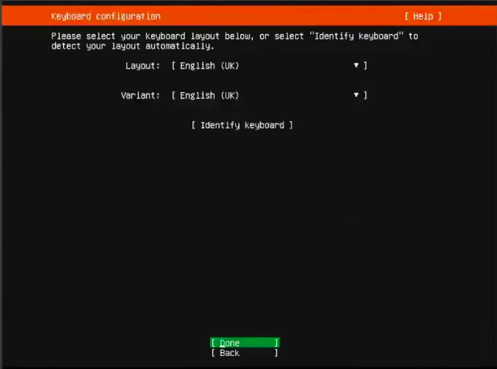
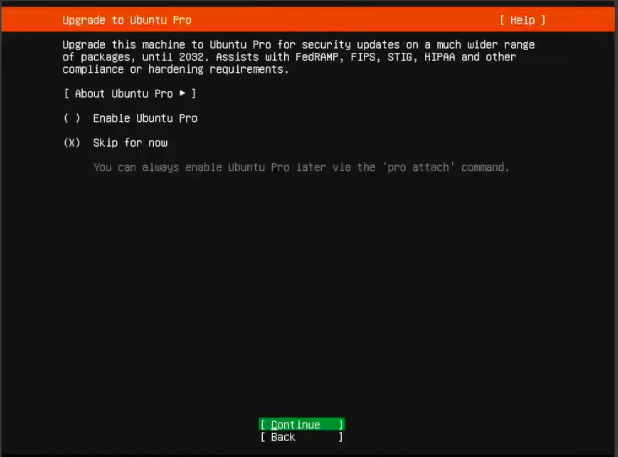
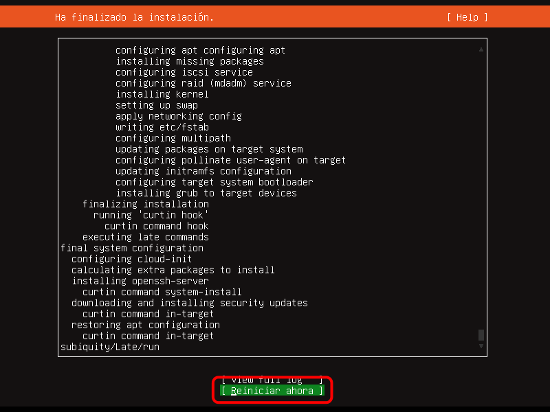
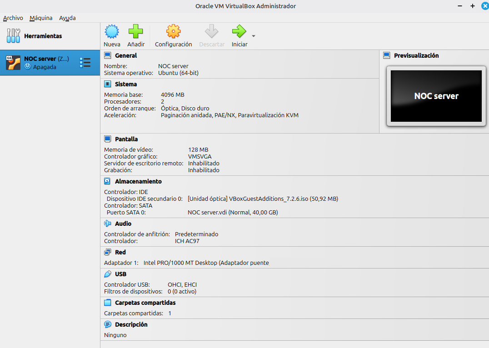

# 🖥️ Instalación de Ubuntu Server para laboratorio NOC

## Descripción

Este documento describe la instalación de Ubuntu Server como base del servidor principal del laboratorio NOC, donde se desplegarán herramientas como Zabbix, base de datos y Grafana.

## Objetivos

* Instalar Ubuntu Server en una máquina virtual
* Preparar el sistema para monitoreo
* Habilitar acceso remoto (SSH)
* Dejar la base lista para servicios NOC

## Requisitos

* Oracle VirtualBox instalado
* Imagen ISO de Ubuntu Server
* Mínimo:
  * 2 GB RAM (recomendado 4 GB)
  * 2 CPU
  * 20 GB disco (recomendado 40 GB)
  * Conexión a internet

## Descarga

Descargar desde el sitio oficial: <https://ubuntu.com/download/server>

Archivo: ubuntu-22.04-live-server-amd64.iso

## Creación de la máquina virtual

En VirtualBox:

* Nombre: NOC-Server
* Tipo: Linux
* Versión: Ubuntu (64-bit)

## Recursos recomendados

| Recurso | Valor |
| :--- | :--- |
| RAM | 4096 MB |
| CPU | 2 |
| Disco | 40 GB |
| Tipo de disco | VDI |
| Asignación | Dinámico |

## Red

Modo: Bridge (recomendado para laboratorio NOC)

## Proceso de instalación

### 1. Selección de idioma

> Elegir:
>
> * English (recomendado) o Español

### 2. Configuración de teclado
  
> Layout:
>
> * Spanish / Latin American



### 3. Tipo de instalación
  
> Seleccionar:
>
> * Ubuntu Server (sin GUI)


### 4. Configuración de red

> * DHCP automático (por defecto)
> * Luego se puede configurar IP fija

### 5. Configuración de proxy

> Dejar vacío (si no aplica)

### 6. Mirror de Ubuntu

> Usar el predeterminado

### 7. Configuración de almacenamiento

> Seleccionar:
>
> * Use entire disk
> * LVM (opcional pero recomendado)  


### 8. Resumen de sistema de archivos


### 9. Perfil de usuario

> Ustedes pueden agregar los datos que prefieran

Ejemplo:

| Campo       | Valor      |
| :---------- | :--------- |
| Name        | admin      |
| Server name | noc-server |
| Username    | admin      |
| Paswword    | ****       |


### 10.Features adicionales

No seleccionar (opcional)



### 11. Instalación de OpenSSH

IMPORTANTE: marcar esta opción

Permite acceso remoto al servidor:

> Instalar servidor OpenSSH

 

### 11.Instalación

> Esperar finalización
> Reiniciar sistema



!!!note Verificación

1. Login `Ingresar con usuario creado`
2. Verificar IP `ip a`
3. Verificar conectividad `ping -c 4 google.com`

## Configuración post-instalación

### 1.Actualizar sistema

```bash
sudo apt update && sudo apt upgrade -y
```

### 2.Configurar zona horaria

```bash
sudo timedatectl set-timezone America/"Ciudad de su preferencia"
```

### 3.Cambiar hostname (opcional)

```bash
sudo hostnamectl set-hostname noc-server
```

### 4.Instalar herramientas básicas

```bash
sudo apt install -y net-tools curl wget git
```

## Configuración de IP estática (opcional recomendado)

Editar:
```bash
sudo nano /etc/netplan/*.yaml
```
Ejemplo:

```bash
network:
  version: 2
  ethernets:
    enp0s3:
      dhcp4: no
      addresses:
        - 192.168.1.100/24
      gateway4: 192.168.1.1
      nameservers:
        addresses: [8.8.8.8, 1.1.1.1]
```

Aplicar cambios:

```bash
sudo netplan apply
```

## 🚨 Problemas comunes

### No hay red

Verificar modo Bridge

Reiniciar interfaz:

```bash
sudo systemctl restart systemd-networkd
```

### No funciona SSH

```bash
sudo systemctl status ssh
```

### IP cambia constantemente

> Configurar IP estática (ver sección anterior)

### Evidencia



