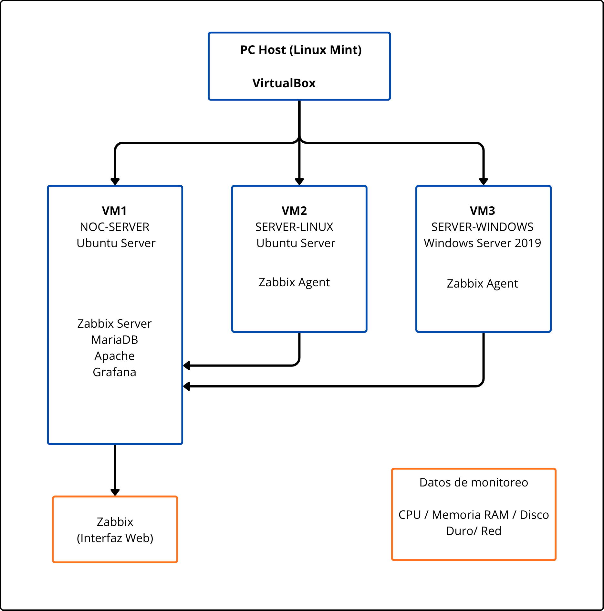

# Arquitectura del Laboratorio NOC  
  
## Objetivo  

Describir la arquitectura del laboratorio de monitoreo basado en Zabbix y Grafana, simulando un entorno real de operación NOC.
  
---  
  
## Entorno base  
  
- Sistema anfitrión: Linux Mint  
- Plataforma de virtualización: VirtualBox  

---  
  
## Resumen de máquinas virtuales  
  
| VM  |  Sistema Operativo  |            Función             |
| :-: | :-----------------: | :----------------------------: |
| VM1 |    Ubuntu Server    |     Servidor de monitoreo      |
| VM2 |    Ubuntu Server    |  Servidor monitoreado (Linux)  |
| VM3 | Windows Server 2019 | Servidor monitoreado (Windows) |

---  
  
## Componentes del laboratorio  
  
### 🔹 VM1: NOC-SERVER  
  
- Sistema operativo: Ubuntu Server  
- Función: Servidor de monitoreo  
- Software:  
  - Zabbix Server  
  - MariaDB  
  - Apache  
  - Grafana  
  
---  
  
### 🔹 VM2: SERVER-LINUX  
  
- Sistema operativo: Ubuntu Server  
- Función: Host monitoreado  
- Software:  
  - Zabbix Agent  
  
---  
  
### 🔹 VM3: SERVER-WINDOWS  
  
- Sistema operativo: Windows Server 2019  
- Función: Host monitoreado  
- Software:  
  - Zabbix Agent  
  
---  
  
## Flujo de monitoreo  

Zabbix Agent (VM2 / VM3)  
↓  
Zabbix Server (VM1)  
↓  
Base de Datos (MariaDB)  
↓  
Frontend Web (Zabbix)  
↓  
Grafana (visualización)

{:width="50%"}

---  
  
## Red del laboratorio  
  
- Tipo: Red interna / NAT (VirtualBox)  
- Comunicación entre VMs habilitada  
- Puerto Zabbix Server: 10051  
- Puerto Zabbix Agent: 10050  
  
---  
  
## Escenarios adicionales (opcional)  
  
- Monitoreo de host local (Linux Mint)  
- Monitoreo de cliente Windows LTSC  
- Pruebas de carga y generación de alertas

---  
  
## Resultado esperado  
  
- Monitoreo centralizado desde VM1  
- Visualización de métricas en Zabbix y Grafana  
- Gestión de múltiples sistemas (Linux + Windows)  
  
---  
  
## Notas  
  
- Este laboratorio simula un entorno real de monitoreo NOC  
- Permite prácticas de troubleshooting, alertas y visualización
  