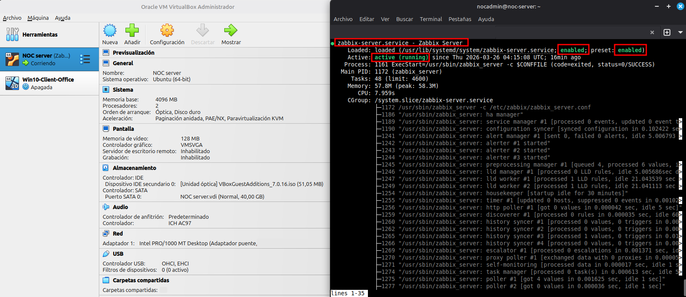

# 🖥️ NOC Lab Monitoring

Laboratorio práctico de monitoreo y troubleshooting usando:

- Zabbix
- Grafana
- VirtualBox

## Objetivo

Simular un entorno NOC real con monitoreo, alertas y resolución de incidentes.

## Contenido

- Instalación de VirtualBox
- Resolución de Kernel Panic
- Monitoreo con Zabbix
- Dashboards con Grafana

## Documentación destacada

[Instalación de VirtualBox en Linux Mint](./01-Instalacion/virtualbox-install.md)
[Kernel Panic + VirtualBox](./05-Incidentes/virtualbox-kernel-panic.md)

## Tecnologías

- Linux Mint 22.2
- VirtualBox 7.0.16
- Zabbix
- Grafana

## Estado del proyecto

En progreso (Laboratorio activo)

## Evidencia

